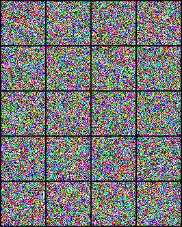
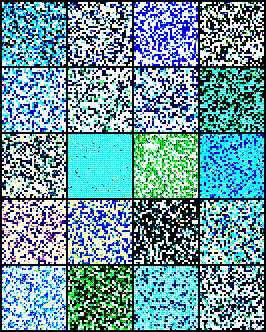

# nanoDiffusion

Minimal PyTorch implementations of:

* [DDPM (Denoising Diffusion Probabilistic Models)](https://arxiv.org/abs/2006.11239)
* [DDIM (Denoising Diffusion Implicit Models)](https://arxiv.org/abs/2010.02502)

with a lightweight DiT-based denoiser.

## Why this repo?

nanoDiffusion is a small, readable diffusion repo meant for learning and experimentation. It keeps the forward noising process, denoising objective, DDPM sampler, DDIM sampler, and DiT denoiser close to the equations, without wrapping the core ideas in a large framework.

## Method

The model learns to predict the noise `eps` added to clean data `x_0` at diffusion timestep `t`.

During training, the forward process constructs:

```text
x_t = sqrt(alphabar_t) x_0 + sqrt(1 - alphabar_t) eps
```

and trains the network to predict `eps` from `x_t`, `t`, and the class label.

`ddpm.py` samples with the stochastic DDPM reverse process, while `ddim.py` uses deterministic DDIM sampling with fewer inference steps.

## Experiment

The default scripts train class-conditional diffusion models on the butterfly dataset:

* Image size: `64x64`
* Image channels: `3`
* Number of classes: `5`
* Denoiser: lightweight DiT
* Hidden size: `512`
* Depth: `12`
* Attention heads: `8`
* Batch size: `64`
* Training epochs: `2000`
* Diffusion timesteps: `1000`
* DDPM sampling steps: `1000`
* DDIM sampling steps: `50`
* Sample/checkpoint interval: every `100` epochs

Most hyperparameters are defined at the top of `ddpm.py` and `ddim.py`.

## Results

The GIFs below show generated samples transitioning from epoch 0 through the end of training.

<h3 align="center">DDPM</h3>

<p align="center">
  
</p>

<h3 align="center">DDIM</h3>

<p align="center">
  
</p>

During training, the scripts periodically:

* Save sample grids as `sample_epoch_*.png`
* Save checkpoints as `checkpoint_epoch_*.pth`

## Code Structure

```text
nanoDiffusion/
├── ddpm.gif
├── ddim.gif
├── ddpm.py
├── ddim.py
└── model.py
```

* `ddpm.py`: DDPM training objective, stochastic reverse sampler, dataset loading, and checkpointing.
* `ddim.py`: DDPM training objective with deterministic DDIM sampling.
* `model.py`: DiT-style image transformer backbone with timestep and class conditioning.

## Data

Download the dataset from Hugging Face into `butterflies/`:

```python
from huggingface_hub import snapshot_download

snapshot_download(
    repo_id="riteshrm/butterflies", repo_type="dataset", local_dir="butterflies"
)
```

The training scripts use `torchvision.datasets.ImageFolder`, so `butterflies/` should be laid out like:

```text
butterflies/
  class_0/
  class_1/
  ...
```

Important: `ddpm.py` and `ddim.py` currently use a Colab-style `main_folder`:

```python
main_folder = "/content/drive/MyDrive/diff"
DATA_DIR = f"{main_folder}/butterflies"
```

Before running locally, update `main_folder` and `DATA_DIR` for your machine. The scripts also write samples and checkpoints under `ddpm/` and `ddim/`, so make sure those output folders exist under your chosen `main_folder`.

## Usage

Train and sample:

```bash
python ddpm.py
# or
python ddim.py
```

Note: the scripts currently assume `NUM_CLASSES = 5` and assert it matches the number of folders found under `butterflies/`.

## References

Detailed explanations and mathematical derivations are available in the accompanying blog post:

* [Diffusion Models Notes](https://riteshrm.github.io/posts/diffusion-models/)

The blog covers:

* Forward diffusion process
* ELBO derivation
* Noise prediction objective
* DDPM sampling
* DDIM deterministic sampling

## Credits

The DiT backbone implementation in `model.py` is adapted from:

* https://github.com/sayakpaul/nanoDiT

The DDPM and DDIM implementations were written from scratch with a focus on minimalism and readability.
